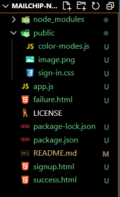
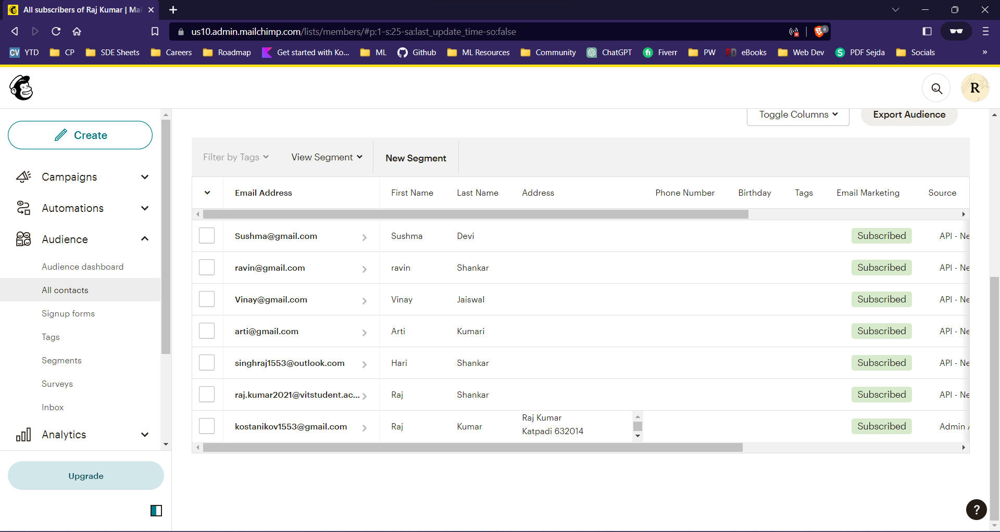

# Mailchimp-Newsletter
A backend website made using Mailchip API to add the email address to mailchip backend.

---

- ### Setting up the Sign Up Page
  1. CD to where you want create your new project. eg. Desktop
  2. Create New Project Folder called Newsletter-Signup
  3. Inside Newsletter-Signup, create a new app.js file, a signup.html file, success.html and failure.html files.
  4. Initialise npm with default options.
  5. Install body-parser, express and request, npm modules to the new project.
  6. Require the newly installed modules inside modules inside app.js
  7. Create a new express app and set it to listen on port 3000.
  8. Once port is set up, log "server is running on port 3000".
```js
//jshint esversion:6
const express = require("express");
const bodyParser = require("body-parser");
const request = require("request");

const app=express();

app.get("/", function(req, res){
    res.send("<h1>Hello Raj!</h1>");
});

app.listen(3000, function(){
    console.log("Server started on port: 3000");
});
```
> Now we will make our signup.html page with Bootstrap.
> - It was simple. Just one important think I learnt in Bootstrap is about those input boxes. We have to go to the sign-in.css and change the class names to .top, .middle and .bottom to make them look uniform.

- Since our homepage ready and is static, but now we also have a server so we have to make our homepage dynamic and to send the html when browser requests.
- When we send our html page we see that it loads but the other parts such as the images and other css files don't get loaded.
- **In order for our server to serve a static website we need to use an special function of express i.e. express.static**
- To use this static we have to make a static Folder "public" and add the other files to the "public" folder.
```js
app.use(express.static("public"));
```
- Move the images and other css to the public folder. Now our files will have relative path with respect to public folder.
```js
//jshint esversion:6
const express = require("express");
const bodyParser = require("body-parser");
const request = require("request");

const app=express();
app.use(express.static("public"));

app.get("/", function(req, res){
    res.sendFile(__dirname+"/signup.html");
});

app.listen(3000, function(){
    console.log("Server started on port: 3000");
});
```
> The File Structure: signup.html has to be outside only.
> 
> 
- Now we have to program our post-route with body parser to get the values filled in the input boxes.
- **Note: For body parser we have to give names to our input boxes.**
- **Note: We also have to specify action(the home route location) and method(post) to our form to accept our responses.**
```html
<form action="/" method="post">
```
```js
//jshint esversion:6
const express = require("express");
const bodyParser = require("body-parser");
const request = require("request");

const app=express();
app.use(express.static("public"));
app.use(bodyParser.urlencoded({extended: true}));

app.get("/", function(req, res){
    res.sendFile(__dirname+"/signup.html");
});

app.post("/", function(req, res){
    // for body parser post routing
    var firstName = req.body.fName;
    var lastName = req.body.lName;
    var email = req.body.email;

    console.log(firstName, lastName, email);
});

app.listen(3000, function(){
    console.log("Server started on port: 3000");
});
```

- Till now our form works and sends the data to our server. Everything is mostly done. Now we have to integrate the API from mailchimp for posting data to their server.
---
- ### Posting Data to Mailchimp's Servers via their API
- Login to Mailchimp.com and make a account ready for API.
- API KEY: 65a96322a3f89b33bb287ba0e728c011-us10
- unique id for Raj Kumar: e7ecd6055c
- Learn about this API from it's documentation.
- We are now ready.
- Let's create a JavaScript Object
- We learnt Node HTTPS to get data but now we have API so we have to request with HTTPS ```https.request(url[,options][,callback])```
```js
//jshint esversion:6
const express = require("express");
const bodyParser = require("body-parser");
const request = require("request");
const https = require("https");

const app=express();
app.use(express.static("public"));
app.use(bodyParser.urlencoded({extended: true}));

app.get("/", function(req, res){
    res.sendFile(__dirname+"/signup.html");
});

app.post("/", function(req, res){
    // for body parser post routing
    const firstName = req.body.fName;
    const lastName = req.body.lName;
    const email = req.body.email;

    // For the API Format
    const data = {
        members: [
            {
                email_address: email,
                status: "subscribed",
                merge_fields: {
                    FNAME: firstName,
                    LNAME:lastName
                }
            }
        ]
    }
    const jsonData = JSON.stringify(data);

    // we are now ready to make the request.
    const url = "https://us10.api.mailchimp.com/3.0/lists/e7ecd6055c";
    const options = {
        method: "POST",
        auth: "raj:65a96322a3f89b33bb287ba0e728c011-us10"
    }
    // We request with the authentication to the API to add this data
    const request = https.request(url, options, function(response){
        response.on("data", function(data){
            console.log(JSON.parse(data));
        })
    })
    request.write(jsonData);
    request.end();
});

app.listen(3000, function(){
    console.log("Server started on port: 3000");
});
```
---
- ### Adding Success and Failure Pages
    - Make success.html and failure.html
    - Make the conditional statement according to the https status code.
    - Make the route for the try again button.
```js
//jshint esversion:6
const express = require("express");
const bodyParser = require("body-parser");
const request = require("request");
const https = require("https");

const app=express();
app.use(express.static("public"));
app.use(bodyParser.urlencoded({extended: true}));

app.get("/", function(req, res){
    res.sendFile(__dirname+"/signup.html");
});

app.post("/", function(req, res){
    // for body parser post routing
    const firstName = req.body.fName;
    const lastName = req.body.lName;
    const email = req.body.email;

    // For the API Format
    const data = {
        members: [
            {
                email_address: email,
                status: "subscribed",
                merge_fields: {
                    FNAME: firstName,
                    LNAME:lastName
                }
            }
        ]
    }
    const jsonData = JSON.stringify(data);

    // we are now ready to make the request.
    const url = "https://us10.api.mailchimp.com/3.0/lists/e7ecd6055c";
    const options = {
        method: "POST",
        auth: "raj:65a96322a3f89b33bb287ba0e728c011-us10"
    }

    const request = https.request(url, options, function(response){

        if (response.statusCode === 200){
            res.sendFile(__dirname+"/success.html");
        }
        else{
            res.sendFile(__dirname+"/failure.html");
        }

        response.on("data", function(data){
            console.log(JSON.parse(data));
        })
    })
    request.write(jsonData);
    request.end();
});

app.post("/failure", function(req, res){
    res.redirect("/");
});

app.listen(3000, function(){
    console.log("Server started on port: 3000");
});
```
- ### Final list of emails in API
